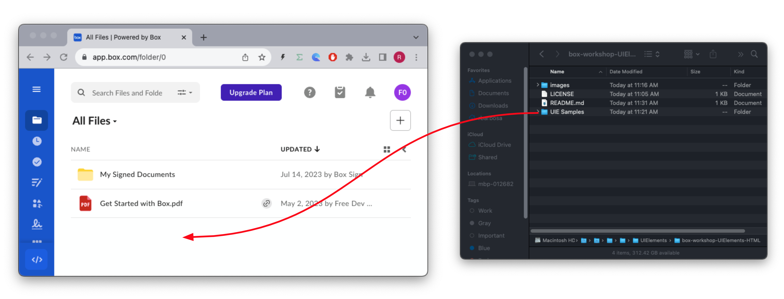
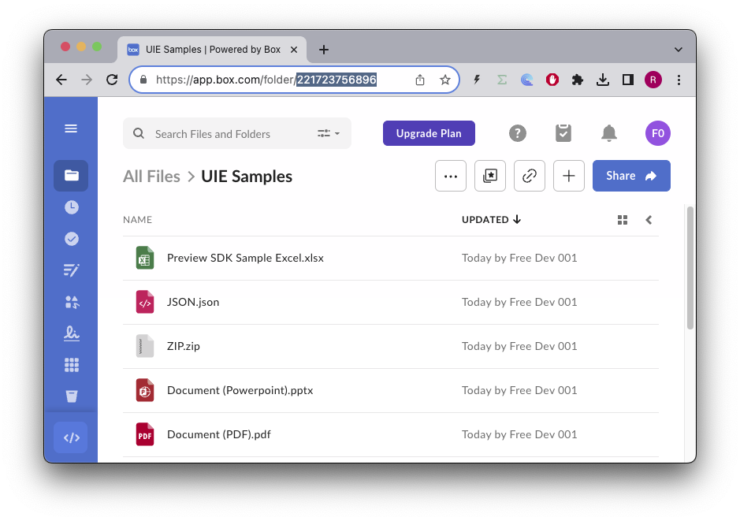

# Box UI Elements Workshop
Workshop on how to use the Box UI Elements in a pure HTML Javascript environment


## Box configuration steps

1. Create a [Box free account](https://www.box.com/pricing/individual) if you don't already have one.
2. Complete the registration process for a Box developer account.
3. Making sure you're logged in navigate to the [Box Developer Console](https://app.box.com/developers/console). This will activate your developer account.
4. Create a new Box application. Select Custom App, fill in the form and then click Next.
5. Select User Authentication (OAuth 2.0) and then click Create App.
7. Check all boxes in application scopes.
6. Scroll to allowed origins and add the following URI:
    - http://localhost:8000
8. Click Save Changes.
9. Go back up and click generate a developer token.
    - Take note of the token, you will need it later.
    - This token is only valid for 60 minutes.


## Installation and configuration

### Get the code
```bash
git clone git@github.com:box-community/box-workshop-UIElements-HTML.git
cd box-workshop-UIElements-HTML
```

### Upload the "./UIE Samples" folder to the root of your box account

Drag and drop the local folder to the root of your box account, thisd will upload the folder and all its contents to your box account.



Navigate to the UIE Samples folder and take note of the folder ID:


In the example above the folder ID is 221723756896

### Questions
If you get stuck or have questions, make sure to ask on our [Box Developer Forum](https://forum.box.com)

# Box UI Elements
Box UI Elements are pre-built UI components that allow developers to add elements of the main Box web application into their own applications. They can be used to navigate through, upload, preview, and select content stored on Box and are available both as React components and framework-agnostic JavaScript libraries.

Check out the [UI Elements guide](https://developer.box.com/guides/embed/ui-elements/) on our developer documentation.

# Workshops
## Security
Any browser client side code is inherently insecure.

This is also true for the Box UI Elements, that require an access token to be passed to them in order to work.

The solution to this problem is to downscope the access token to a token that only has the necessary access level, and only to the file or folder that contains the files that the UI Elements will be working with.

In this workshop we will be using a developer token, which is only valid for 60 minutes, but it has full access to the account.

In a production environment you would use a downscoped token, and you would also use a server side component to generate the token.

To learn more about downscoping tokens, check out the [Box Developer Documentation](https://developer.box.com/guides/authentication/tokens/downscope/)

On each section you will find which scopes apply to each UI Element, or alternatively you can check the [Scopes for downscoping](https://developer.box.com/guides/api-calls/permissions-and-errors/scopes/#scopes-for-downscoping) in our documentation.

## Exercises
You'll find the workshop exercises in the [workshops](workshops) folder.
* [Explorer](workshops/Explorer/Explorer.md)
* [Picker](workshops/Picker/Picker.md)
* [Uploader](workshops/Uploader/Uploader.md)
* [Preview](workshops/Previewer/Previewer.md)
* [Sidebar](workshops/Sidebar/Sidebar.md)

## Running the samples
You'll need some sort of web server to run the samples. The easiest way is to use the python SimpleHTTPServer module.

```bash
python3 -m http.server 8000
```